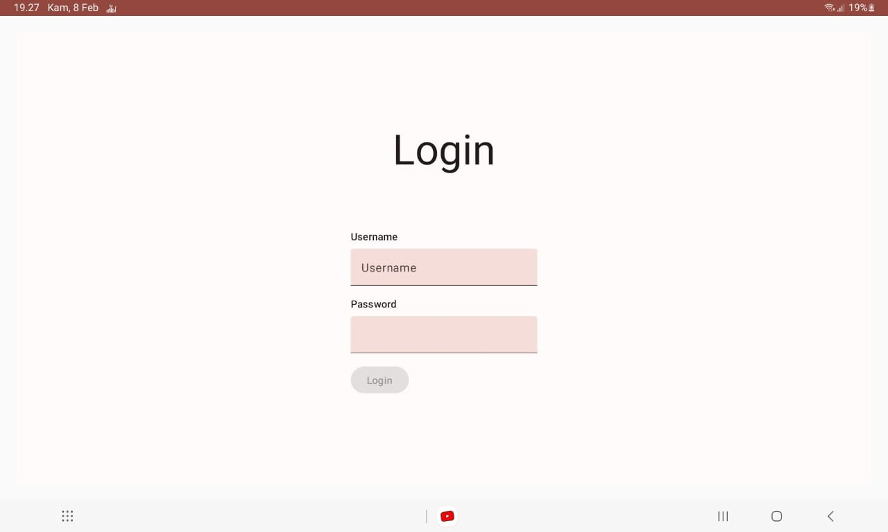
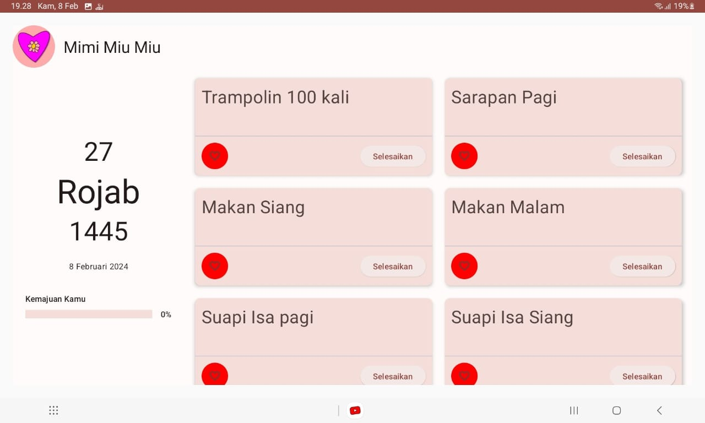
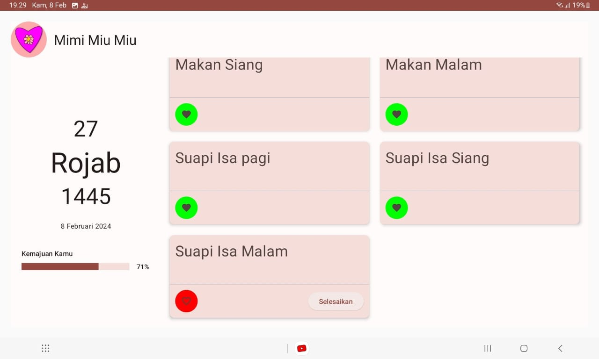

# Daily Tracker Child

Track your children's task daily.

### Note:

Children and Tasks management currently still manually in the [backend side here](https://github.com/ihfazhillah/ksatriamuslim_backend/tree/main/ksatria_muslim/children_task)

## Features

- multiple child
- display task
- mark task as done

## Task types

- yes/no
- need verification

## Screenshots

Click to see screenshot

